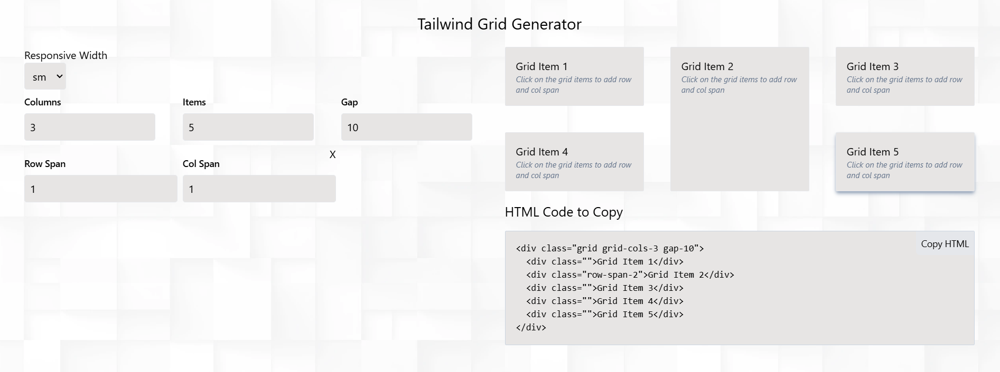

### Tailwind Grid Generator - Features

- **Flexible Grid Configuration**: Easily customize rows, columns, and gap settings to design your grid layout.
- **Responsive Design Support**: Adjust grid settings for different screen sizes using Tailwind’s responsive utilities.
- **One-Click HTML Copy**: Generate and copy the grid’s HTML structure effortlessly.
- **Live Preview**: Instantly see your changes as you tweak the grid settings.
- **Editable Grid Items**: Modify individual grid items by adjusting row and column spans.



## Recommended IDE Setup

Use [VSCode](https://code.visualstudio.com/) with [Volar](https://marketplace.visualstudio.com/items?itemName=Vue.volar) (disable Vetur for better compatibility).

## Type Support for `.vue` Imports in TypeScript

Since TypeScript doesn’t natively support `.vue` imports, we replace `tsc` with `vue-tsc` for type checking. To enable proper TypeScript support in editors, install [Volar](https://marketplace.visualstudio.com/items?itemName=Vue.volar).

## Customizing Configuration

For advanced configuration options, refer to the [Vite Configuration Reference](https://vite.dev/config/).

## Project Setup

Install dependencies:

```sh
npm install
```

### Run Development Server

```sh
npm run dev
```

### Build for Production

```sh
npm run build
```
